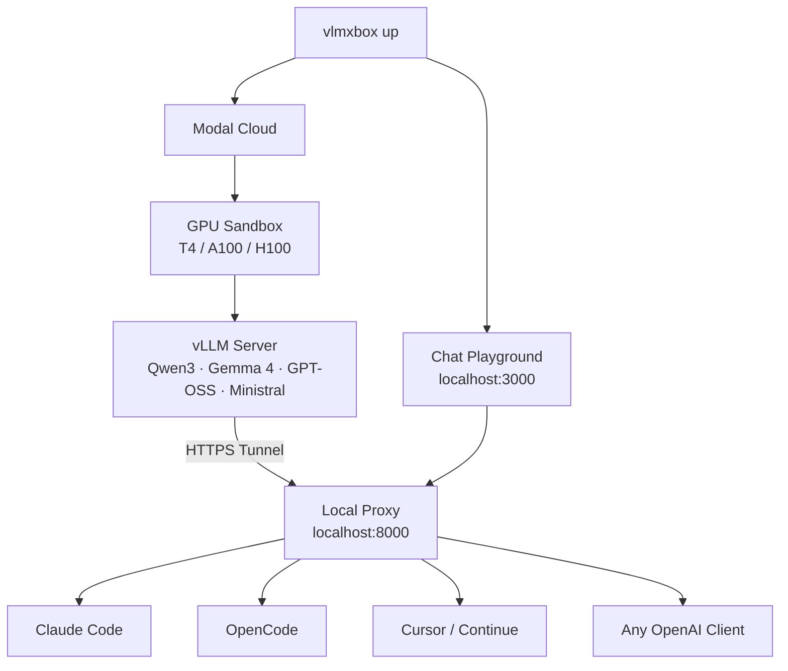

# vlmxbox

The easiest way to self-host open-source AI models. One command, any model, serverless GPU.

```bash
vlmxbox up
```

No Docker. No Kubernetes. No GPU setup. Just pick a model and go.


vlmxbox spins up a [vLLM](https://vllm.ai) server on [Modal.com](https://modal.com) serverless GPU, proxies it to `localhost:8000` (OpenAI-compatible API), and launches a chat playground at `localhost:3000`. Models start from **$0.59/hr** and auto-stop when idle — you only pay while you're using it.

## How it works



Any tool that speaks OpenAI API connects to `localhost:8000` — Claude Code, OpenCode, Cursor, Continue, or your own app.

## Install

### One-liner (recommended)

```bash
curl -fsSL https://raw.githubusercontent.com/ancs21/vlmxbox/main/install.sh | bash
```

Downloads the latest binary for your OS/arch to `~/.vlmxbox/bin/vlmxbox`.

### From source

Requires [Bun](https://bun.sh).

```bash
git clone https://github.com/ancs21/vlmxbox.git
cd vlmxbox
bun install
bun run build    # compiles standalone binary
./vlmxbox --help
```

### Modal setup (one-time)

```bash
pip install modal
modal setup    # opens browser for auth
```

## Usage

### Start a model

```bash
# Interactive model picker
vlmxbox up

# Or pick a preset directly
vlmxbox up --preset qwen3-4b
vlmxbox up --preset gemma4-31b-vision
vlmxbox up --preset gpt-oss-120b

# Fast startup (skip CUDA compilation, ~10-20% slower inference)
vlmxbox up --preset qwen3-4b --fast
```

### Connect your tools

Once vlmxbox shows "running", connect any OpenAI-compatible tool:

**Claude Code:**
```bash
export ANTHROPIC_BASE_URL=http://localhost:8000
export ANTHROPIC_API_KEY=dummy
export ANTHROPIC_MODEL=Qwen/Qwen3-4B
claude
```

**OpenCode:**
```bash
# Add to ~/.config/opencode/opencode.json
{
  "provider": {
    "vlmxbox": {
      "npm": "@ai-sdk/openai-compatible",
      "name": "vlmxbox",
      "options": { "baseURL": "http://localhost:8000/v1", "apiKey": "dummy" },
      "models": { "Qwen/Qwen3-4B": { "name": "Qwen3 4B" } }
    }
  }
}
```

**Python (OpenAI SDK):**
```python
from openai import OpenAI
client = OpenAI(base_url="http://localhost:8000/v1", api_key="dummy")
response = client.chat.completions.create(
    model="Qwen/Qwen3-4B",
    messages=[{"role": "user", "content": "Hello!"}],
)
```

**curl:**
```bash
curl http://localhost:8000/v1/chat/completions \
  -H "Content-Type: application/json" \
  -d '{"model":"Qwen/Qwen3-4B","messages":[{"role":"user","content":"Hello!"}]}'
```

### Manage

```bash
vlmxbox status     # check if sandbox is running
vlmxbox down       # stop the sandbox
vlmxbox restart    # stop and start with new config
vlmxbox presets    # list all available models
```

## Model Presets

All presets use models with **Apache 2.0** license. Configs match the official [vLLM recipes](https://docs.vllm.ai/projects/recipes/).

### Budget ($0.59/hr — T4 GPU)

| Preset | Model | Params | Features |
|--------|-------|--------|----------|
| `gemma4-e2b` | Gemma 4 E2B | 2B eff | Vision, tool calling |
| `gemma4-e4b` | Gemma 4 E4B | 4B eff | Vision, tool calling |
| `qwen3-4b` | Qwen3 4B | 4B | Thinking, tool calling |
| `qwen3-30b-moe` | Qwen3 30B MoE | 3B active | Thinking, tool calling, 30B quality |
| `ministral-3b` | Ministral 3B | 3B | Tool calling, vision |
| `ministral-3b-reasoning` | Ministral 3B | 3B | Thinking, tool calling, vision |

### Mid-range ($1.10/hr — A10G GPU)

| Preset | Model | Params | Features |
|--------|-------|--------|----------|
| `qwen3-8b` | Qwen3 8B | 8B | Thinking, tool calling |
| `ministral-8b` | Ministral 8B | 8B | Tool calling, vision |
| `ministral-8b-reasoning` | Ministral 8B | 8B | Thinking, tool calling, vision |

### Strong ($2.50/hr — A100 80GB)

| Preset | Model | Params | Features |
|--------|-------|--------|----------|
| `gemma4-moe` | Gemma 4 26B MoE | 4B active | Tool calling, 26B quality |
| `qwen3-32b` | Qwen3 32B | 32B | Thinking, tool calling |
| `gpt-oss-20b` | GPT-OSS 20B | 3.6B active | Reasoning, tool calling |
| `gpt-oss-120b` | GPT-OSS 120B | 5.1B active | Strong reasoning, tool calling |

### Max ($3.95-7.90/hr — H100)

| Preset | Model | GPU | Features |
|--------|-------|-----|----------|
| `ministral-14b` | Ministral 14B | 1× H100 | Tool calling, vision |
| `gemma4-31b` | Gemma 4 31B | 2× H100 | Thinking, tool calling |
| `gemma4-31b-vision` | Gemma 4 31B | 2× H100 | Thinking, tool calling, vision |
| `ministral-14b-reasoning` | Ministral 14B | 2× H100 | Thinking, tool calling, vision |

### Beast ($31.58/hr — 8× H100)

| Preset | Model | Params | Features |
|--------|-------|--------|----------|
| `qwen3.5-text` | Qwen3.5 397B MoE FP8 | 17B active | Throughput-optimized |
| `qwen3.5-vision` | Qwen3.5 397B MoE FP8 | 17B active | Multimodal |
| `qwen3.5-latency` | Qwen3.5 397B MoE FP8 | 17B active | Low-latency (MTP-1) |
| `gpt-oss-120b-tp8` | GPT-OSS 120B | 5.1B active | Max throughput |

## CLI Options

```
vlmxbox up [options]

Options:
  --preset <name>       Model preset (see `vlmxbox presets`)
  --fast                Skip CUDA compilation for faster startup (-O0)
  --model <id>          Override HuggingFace model ID
  --gpu <type>          Override GPU type (T4, A10G, A100-80GB, H100, H100:2, etc.)
  --timeout <ms>        Idle timeout in ms (default: 600000 = 10 min)
  --tool-parser <name>  Override vLLM tool-call parser
  --vllm-image <tag>    Override vLLM Docker image
  --help                Show help
```

## Performance

vlmxbox caches model weights and compiled CUDA kernels on Modal Volumes:

| | First run | Warm restart |
|---|---|---|
| Model download | ~40-240s | **0s** (cached) |
| Weight loading | ~15-55s | ~15-55s |
| torch.compile | ~25-70s | **~3-9s** (cached) |
| CUDA graphs | ~5-10s | ~5-10s |
| **Total** | **~2-6 min** | **~40-80s** |

Use `--fast` to skip torch.compile and CUDA graphs entirely (~20s startup, ~10-20% slower inference).


## Environment Variables

| Variable | Purpose |
|----------|---------|
| `MODAL_TOKEN_ID` | Modal authentication |
| `MODAL_TOKEN_SECRET` | Modal authentication |
| `HF_TOKEN` | HuggingFace token (for gated models, faster downloads) |

## License

Apache 2.0 — see [LICENSE](LICENSE).

All default model presets use Apache 2.0 licensed models (Gemma 4, Qwen3, GPT-OSS, Ministral).
